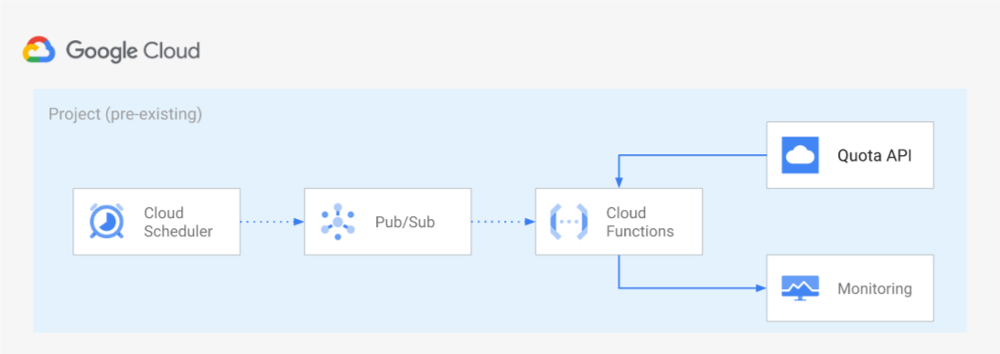

## Quota Monitoring

### 개요
- 목적
  * 프로젝트별 Quota의 사용현황 모니터링
  * 지정한 threshold 초과 시 alert를 발생시켜 관리자에게 알리기 위함
- 기타
  * Terraform으로 생성
  * Cloud Monitoring의 Consumer Quota 리소스 타입 사용
  * 구성도
   
  

### 사용 서비스
- Cloud Scheduler
- Pub/Sub
- Cloud Functions
- Cloud Monitoring

### Pre-requisites
- Terraform 버전이 1.3.1 이상이어야 함
- 실행하는 계정에 아래의 권한을 포함하는 Role 필요
  - Cloud Scheduler Admin
  - Pub/Sub Admin
  - Cloud Functions Admin
  - Service Account Admin
  - Monitoring Admin

### 실행 방법

1. 프로젝트 ID와 region 입력
    1.  blueprints > cloud-operations > quota-monitoring > variables.tf의 project_id와 region에 각각 프로젝트 ID, region 입력
2. threshold_value 조정
    1.  blueprints > cloud-operations > quota-monitoring > main.tf의 각 alert resource에 지정된 default threshold_value를 프로젝트 상황에 맞게 조정
3. Cloud Scheduler Frequency 조정
    1.  blueprints > cloud-operations > quota-monitoring > variables.tf의 schedule_config에 실행될 Frequency 조정
4. Terraform 실행
    1.  blueprints/cloud-operations/quota-monitoring로 디렉토리 이동
    2.  terraform init
    3.  terraform apply -var project_id=[project_id]
5. 생성된 리소스 확인
    1.  "실행 시 생성되는 리소스 목록" 참고하여 리소스 생성 확인
    2.  Alerting Policy 활성화

 

- 실행 시 생성되는 리소스 목록
  * Cloud IAM
    - tf-cf-quota-monitor@[project_id].iam.gserviceaccount.com (Role: Compute Network Viewer, Monitoring Metric Writer, Quota Viewer)
  * Cloud Scheduler 
    - quota-monitor (Frequency : 0 * * * * (UTC))
  * Pub/Sub
    - Topic : quota-monitor
    - Subscriptions : gcf-quota-monitor-asia-northeast3-quota-monitor, quota-monitor-default
  * Cloud Functions
    - quota-monitor (Memory allocated : 256MB(default), Runtime : Python 3.x) 
  * Cloud Monitoring (아래 목록들로 Quota 모니터링이 이루어짐)
    - CPU Count : vCPU 개수 모니터링 (default threshold: 10)
    - BigQuery Total Slots : BigQuery Slot 사용량 모니터링 (default threshold: 50)
    - BigQuery Usages : BigQuery 사용량 모니터링 - Limit에 도달할 경우 alert 발생 (default threshold: 0)
    - Service Account Count : Service Account 개수 모니터링 (default threshold: 10)
    - Compute Engine Instances : Compute Engine 인스턴스 개수 모니터링 (default threshold: 10)
    - In Use Adresses(Global) : 사용 중인 Global IP 주소 개수 모니터링 (default threshold: 10)
    - In Use Adresses(Regional) : 사용 중인 Regional IP 주소 개수 모니터링 (default threshold: 10)
    - Firewalls : Firewall 개수 모니터링 (default threshold: 10)

### 폴더 및 주요코드 구성

- blueprints > cloud-operations > quota-monitoring
  * main.tf, variables.tf 등이 있는 메인 디렉토리
- modules
  * 리소스를 생성하는데 필요한 모듈이 있는 디렉토리

### 주의 및 제약 사항

- Alerting Policy 생성 후 활성화되었는지 확인 필요
- variables.tf에 선언된 region을 default로 Alerting Policy를 생성하므로 모니터링하고 싶은 리소스가 default region이 아니라면 별도 지정해주어야 함
- 모니터링 항목 추가 시 아래의 절차 필요
  1. Metrics explorer > Resource & Metric에서 Consumer Quota 입력 후 Metric 선택
      1. Metric은 [링크](https://cloud.google.com/docs/quota#types_of_quota) 참고
  2. Filters에서 추가하고 싶은 항목의 quota_metric을 필터링
  3. 그래프로 추이 확인 후 alert을 받을 threshold 값 정하기
  4. main.tf에서 기존 리소스를 복사하여 값 변경
      1. Reference name, display_name, threshold_value, content
      2. filter는 아래의 형태로 변경
          "metric.type=\"[Metric 이름]\" resource.type=\"consumer_quota\" metric.label.quota_metric=\"[quota_metric 이름]\""

### 참고자료
- https://github.com/GoogleCloudPlatform/cloud-foundation-fabric/tree/master/blueprints/cloud-operations/quota-monitoring
