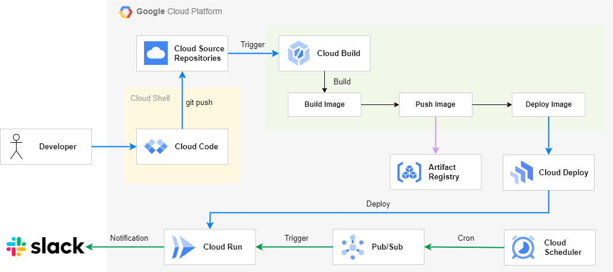
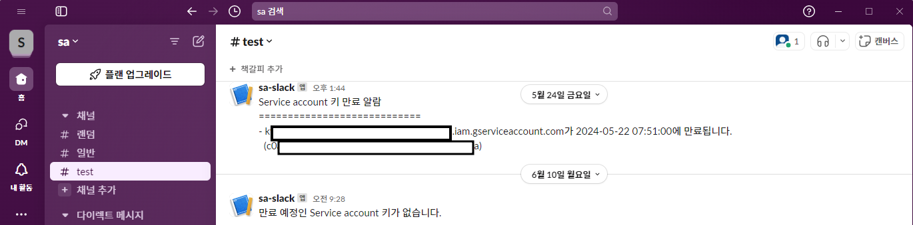

## **SAkeyExpirationAlarm**

### 개요
- 목적
  * GCP 프로젝트 내 Service Account key(USER_MANAGED)의 만료일 이전에 slack 알림을 발생하여 사용자가 키 만료일을 인지한다.
  * CI/CD 파이프라인을 구축하여 변경사항을 쉽게 변경한다.
- 파일 설명
  * app.py : 키 만료일을 계산한 후 slack 알람을 전송
  * requirements.txt : Cloud Run 실행 시 필요한 외부 라이브러리 및 종속성

### 사용 서비스
- Cloud Run
- Cloud Scheduler
- Slack
- Cloud Build
- Artifact Registries
- Pub/Sub
 

### Pre-requisites
- Slack Workspace에 채널을 만들어 Webhook URL을 생성합니다.
- Cloud Scheduler가 Cloud Run를 호출할 수 있도록 Cloud Scheduler를 실행하는 서비스 계정에 Cloud Run Invoker 권한을 부여합니다.

### 실행 방법
1. 해당 리포지토리를 Cloud Shell 혹은 로컬 환경에 Clone합니다.
2. 빌드한 이미지를 저장할 Artificial Registry를 생성합니다.
3. 각 파일에 알맞는 변수값을 입력합니다.
  - Dockerfile : [PROJECT_NAME]에는 GCP 프로젝트 이름, [SLACK_WEBHOOK_URL]에는 생성한 Slack Webhook URL을 입력합니다.
  - app.py : Dockerfile과 같이 동일하게 입력하고, left_days : 만료일로부터 며칠 이전에 알림을 받을지 입력합니다. 예) 7
  - cloudbuild.yaml : [Artificial Registry Image URL]에 Artificial Registry에 저장될 이미지의 이름을 입력합니다.
4. Cloud Build를 생성합니다.
  - Name : Trigger 이름을 입력합니다.
  - Region : 리전을 선택합니다.
  - Event : Push to a branch
  - Source : 1st gen
  - Repository : 앞서 생성한 Cloud Soure Repositories를 선택합니다.
  - Type : Cloud Build configuration file (yaml or json)
  - Location : Repository
  - Cloud Build configuration file location : cloudbuild.yaml
5. Pub/Sub을 생성합니다.
  - Topic : Topic ID를 입력한 후 기본 셋팅으로 CREATE를 합니다.
  - Subscriptions
    - Subscription ID : Subscription ID를 입력하여 생성합니다.
    - Select a Cloud Pub/Sub topic : 앞서 생성한 Pub/Sub Topic을 선택합니다.
    - Delivery type : Push를 선택한 후 Endpoint URL에 Cloud Run URL을 입력합니다.
6. Cloud Scheduler를 생성합니다.
  * Frequency : cron 형식을 따라 주기를 입력합니다. 예) 0 9 * * *
  * Target type : Pub/Sub
  * Select a Cloud Pub/Sub topic : 앞서 생성한 Pub/Sub Topic을 선택합니다.
  * Message body : {}
5. Cloud Source Repositories에 git push를 하면 CI/CD 파이프라인을 거쳐 Slack 메시지가 전송됩니다.

### 실행 결과
- Cloud Scheduler의 배치 작업이 실행되면 아래 이미지와 같이 Slack 채널에 메시지가 수신됩니다.

