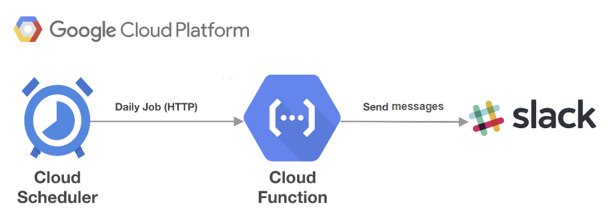
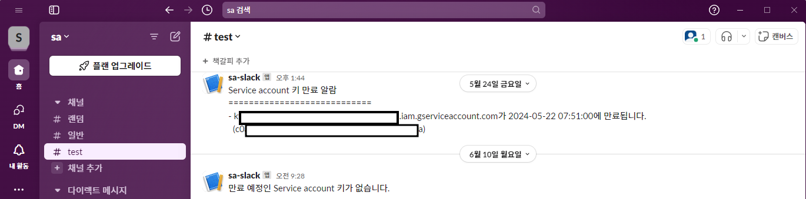

## **SAkeyExpirationAlarm**

### 개요
- 목적
  * GCP 프로젝트 내 Service Account key(USER_MANAGED)의 만료일 이전에 slack 알림을 발생하여 사용자가 키 만료일을 인지한다.
  * Cloud Functions에서 코드 수정으로 변경사항을 쉽게 변경한다.
- 파일 설명
  * main.py : 키 만료일을 계산한 후 slack 알람을 전송
  * requirements.txt : Cloud Functions 실행 시 필요한 외부 라이브러리 및 종속성
- #### CI/CD 파이프라인을 통한 컨테이너 형식으로 배포 시에는 pipeline > README_pipeline.md를 참고합니다.

### 사용 서비스
- Cloud Functions(2nd gen)
- Cloud Scheduler
- Slack 

### Pre-requisites
- Slack Workspace에 채널을 만들어 Webhook URL을 생성합니다.
- Cloud Scheduler가 Cloud Functions를 호출할 수 있도록 Cloud Scheduler를 실행하는 서비스 계정에 Cloud Functions Invoker 권한을 부여합니다.
  - Cloud Functions이 2세대일 경우 Cloud Run이 함께 생성되므로, Cloud Functions이 아닌 Cloud Run을 동작시킬 경우 서비스 계정에 Cloud Run Invoker 권한을 부여합니다.

### 실행 방법
1. 생성한 Slack의 Webhook URL을 준비합니다.
2. Cloud Functions > CREATE FUNCTION을 클릭하여 configuration 단계에서 다음과 같이 설정합니다.
  * Environment : 2nd gen
  * Trigger type : HTTPS
  * Authentication : Require authentication
3. NEXT를 클릭하여 Code 단계에서 다음과 같이 설정합니다.
  * Runtime : Python 3.8 이상
  * Entry point : main
  * main.py, requirements.txt에 해당 리포지토리의 소스와 라이브러리를 붙여넣습니다.
  * main.py 코드 상단의 변수값을 입력합니다.
    * project_name : projects/ 뒤에 프로젝트 이름을 입력합니다.
    * webhook_url : 앞서 생성한 Slack Webhook URL을 입력합니다. 예) https://hooks.slack.com/services/AAA/BBB/CCC
    * left_days : 만료일로부터 며칠 이전에 알림을 받을지 입력합니다. 예) 7
4. TEST FUNCTION 버튼을 클릭하여 slack 채널에 알람이 전송되는지 확인한 후 DEPLOY를 합니다.
5. Cloud Scheduler를 생성합니다.
  * Target type : HTTP
  * Frequency : cron 형식을 따라 주기를 입력합니다. 예) 0 9 * * *
  * URL : 생성한 Cloud Functions의 URL(Cloud Run을 이용할 경우 Cloud Run의 URL)
  * HTTP method : GET
  * Auth header : Add OIDC token
  * Service Account : 앞서 Cloud Functions Invoker(혹은 Cloud Run Invoker) 권한을 부여한 Service Account 계정

### 실행 결과
- Cloud Scheduler의 배치 작업이 실행되면 아래 이미지와 같이 Slack 채널에 메시지가 수신됩니다.

